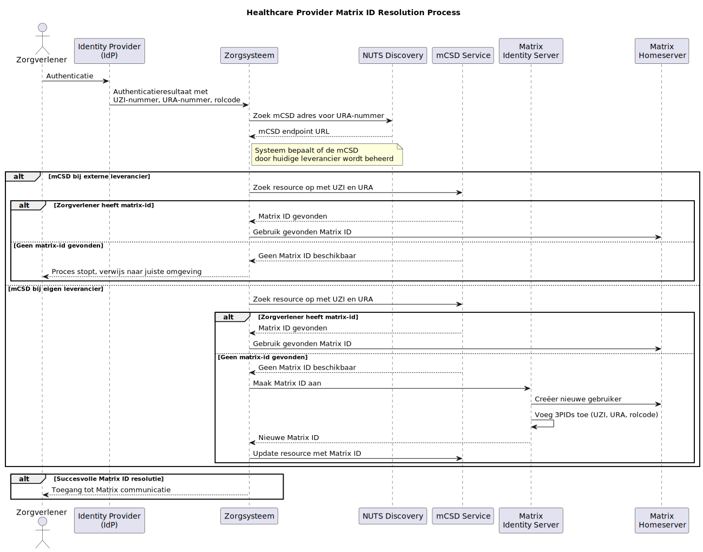

## 🏗️ Toepassing instante communicatie

---
### Copyright


This document is released under the [Attribution-ShareAlike 4.0 International \(CC BY-SA 4.0\) license](https://creativecommons.org/licenses/by-sa/4.0/).
---

### **1. Doelstelling**

Het vaststellen van **matrix.org** als een veilig, gefedereerd communicatieprotocol voor zorgsystemen om gestandaardiseerde instant messaging, zorgcoördinatie en teamgerichte workflows mogelijk te maken—afgestemd op zorgdatastandaarden en identiteitsbeheer.

---

### **2. Use Cases**

Gebaseerd op real-world vereisten van zorgplatforms, demonstreren de volgende use cases de praktische toepassing van Matrix voor zorgcommunicatie:

#### 📋 UC1: Netwerkbeheer
**Zorgnetwerk Ophalen**
- Alle deelnemers in het zorgnetwerk van een cliënt ophalen
- Per deelnemer weergeven: naam, functie/relatie en afwezigheidsperiodes indien van toepassing
- Ondersteuning voor zowel lokale als gefedereerde netwerkontdekking via mCSD

#### 💬 UC2: Nieuwe Gesprekken Starten
**Nieuwe Berichtthread Aanmaken**
- Verplichte velden: onderwerp (max 50 tekens), berichtinhoud (onbeperkt), ontvangers, verzender
- Optioneel: tot 5 bijlagen per bericht
- Automatische cliëntassociatie via Matrix space membership
- Ontvangers geselecteerd uit zorgnetwerk deelnemers

#### 📝 UC3: Berichtenbeheer
**Berichten Weergeven en Beheren**
- Berichtenlijst ophalen voor specifieke cliënt
- Per bericht weergeven: ID, onderwerp, status (gearchiveerd/actief), deelnemers
- Specifieke berichten bekijken met alle reacties, bijlagen en deelnemersrollen
- Op toestemming gebaseerde verwijderrechten ("allow_destroy" per reactie/bijlage)

#### 🔄 UC4: Cross-Platform Integratie
**Bestaande Netwerk Migratie**
- Zorgaanbieder wisselt van platform (bijv. van propriëtair systeem naar Matrix)
- Bestaande zorgnetwerken moeten behouden blijven bij platformwisseling
- Professionals verhuizen naar nieuwe systemen met behoud van zorgcontexten
- Automatische homeserver migratie met room her-uitnodigingen

#### 🏥 UC5: Multi-Organisatie Samenwerking
**Inter-Organisatorische Communicatie**
- Apotheken, huisartsen en specialisten die samenwerken aan cliëntzorg
- Elke organisatie behoudt eigen homeserver en identiteitsbeheer
- Gefedereerde ontdekking via mCSD voor het vinden van zorgverleners tussen organisaties
- Naadloze communicatie ondanks verschillende onderliggende zorgsystemen

#### 👨‍⚕️ UC6: Professionele vs. Cliëntcommunicatie
**Selectieve Deelname**
- Alleen-professionele discussies (medicatiereview, zorgplanning)
- Cliënt/familie inclusieve gesprekken (zorgupdates, educatieve inhoud)
- Power level beheer zorgt voor juiste toegangsrechten
- Cliëntaanwezigheid in rooms is configureerbaar per gesprekstype

#### 📱 UC7: Multi-Modale Toegang
**Platform-Agnostische Toegang**
- Webinterfaces voor uitgebreide workflow integratie
- Mobiele apps voor onderweg communicatie
- Push notificaties voor urgente berichten
- Offline bericht queueing en synchronisatie

#### 🔐 UC8: Compliance en Audit
**Zorgregulatie Compliance**
- Berichtretentiebeleid afgestemd op bewaarintermijnen van zorgdossiers
- Audittrails voor alle communicaties
- Privacy controles voor gevoelige discussies
- Integratie met bestaande zorginformatiesystemen voor archivering

---

### **3. Identiteit & Authenticatie Integratie**

#### ✅ Identiteit Mapping

- **Matrix User IDs** moeten gekoppeld worden aan bestaande zorgidentiteiten:
  - **Zorgverleners**: Gebruik OIDC authenticatie via Identity Provider (IdP) van zorgaanbieder. mCSD wordt gebruikt om de mogelijke Matrix account van de Zorgverlener te lokaliseren op basis van hun identiteit in het zorgsysteem. Het UZI-nummer, URA-nummer en rolcode(s) worden gebruikt als 3PIDs voor identificatie.
  - **RelatedPersons (bijv. mantelzorgers)**: Gebruik email + wachtwoord + 2FA via zorgplatform. Het email-adres wordt gebruikt als 3PID voor identificatie.
  - **Cliënten**: Optioneel onboarded; kunnen lokale Matrix accounts hebben gebaseerd op email. Het email-adres wordt gebruikt als 3PID voor identificatie.

#### 🔄 3PID Identificatie voor Zorgverleners

Voor zorgverleners (Practitioners) is het essentieel dat vanuit hun Matrix ID de bijbehorende mCSD FHIR resource URL kan worden achterhaald. Dit is nodig om het CareTeam correct te kunnen vullen met de juiste FHIR resource referenties voor implementaties die met FHIR werken.

Zorgverleners worden daarom in Matrix geïdentificeerd met zowel hun Matrix ID als hun UZI-nummer, URA-nummer en rolcode als 3PIDs (Third-Party IDs):

- **Reverse-lookup functionaliteit**: Het ontvangende systeem moet de zorgidentiteit van de Practitioner kunnen terugzoeken om de mCSD FHIR resource URL te vinden
- **FHIR resource koppeling**: De UZI, URA en rolcode worden toegevoegd als 3PIDs in het Matrix gebruikersprofiel, waardoor de bijbehorende Practitioner of PractitionerRole resource URL kan worden achterhaald
- **Consistente identiteit**: Het 3PID mechanisme zorgt voor een betrouwbare koppeling tussen Matrix-identiteit en zorgsysteemidentiteit
- **Cross-systeem interoperabiliteit**: Deze aanpak garandeert dat de identiteit consistent blijft tussen verschillende zorgsystemen

**Identificatie-elementen:**
- **UZI-nummer**: Persoonlijke identifier voor de zorgverlener
- **URA-nummer**: Identificeert de zorgorganisatie waar de zorgverlener werkzaam is
- **Rolcode**: Geeft aan welke (beroeps-)rol de zorgverlener vervult bij de zorgaanbieder (conform FHIR PractitionerRole)

Een zorgverlener kan meerdere rollen hebben bij dezelfde of verschillende organisaties, wat resulteert in meerdere PractitionerRole resources en bijbehorende 3PID combinaties.

**Voorbeeld van 3PID toevoeging:**
```json
{
  "threepids": [
    {
      "medium": "uzi_nr",
      "address": "123456789",
      "validated_at": 1674123456789
    },
    {
      "medium": "ura_nr",
      "address": "00000001",
      "validated_at": 1674123456789
    },
    {
      "medium": "role_code",
      "address": "158965000",
      "validated_at": 1674123456789
    },
    {
      "medium": "email",
      "address": "dr.janssen@hospital-a.nl",
      "validated_at": 1674123456789
    }
  ]
}
```

Deze methode zorgt voor een betere interoperabiliteit en vertrouwen tussen verschillende zorgsystemen die via Matrix communiceren, waarbij gebruik wordt gemaakt van de gestandaardiseerde zorgsector identifiers inclusief de specifieke rol die de zorgverlener vervult.

#### 🏠 Homeserver Toewijzing

- Voor **Zorgverleners**: Homeserver toewijzing is niet vastgepind aan oorsprong:
  - Zorgaanbieders kiezen welke serviceprovider hun homeserver host
  - Het homeserver adres wordt gepubliceerd door de Generieke Functie Adressering via mCSD endpoint
  - Dit zorgt voor flexibiliteit wanneer zorgaanbieders van leverancier wisselen

- Voor **RelatedPersons** (bijv. mantelzorgers) en **Cliënten**:
  - Gebonden aan het platform van oorsprong (het zorgplatform dat hen onboard)

#### ✅ IdentityServer API

- Implementeer een **Matrix IdentityServer** die ondersteunt:
  - Voor **Zorgverleners**: Na succesvolle authenticatie is het UZI-nummer en URA-nummer, en mogelijk de rolcode bekend. Op basis van het URA-nummer wordt opgezocht wat het mCSD adres van de zorgaanbieder is:
    1. Zoek op waar de mCSD van het URA-nummer staat (nu is dat met NUTS discovery)
    2. Als de gebruiker bij een ander mCSD staat:
       - Zoek de resource op in dat externe mCSD
       - Als die daar geen matrix-id heeft stopt het proces daar
       - Als die wel bestaat, gebruik die gevonden matrix-id
    3. Als de mCSD omgeving de eigen is:
       - Kijk in de eigen mCSD database of deze al een matrix-account heeft
       - Zo niet, maak dan een matrix-id aan met als 3PID de UZI, URA en eventueel rolcode
  - Voor **RelatedPersons** (bijv. mantelzorgers) en **Cliënten** worden identiteiten verschaft door het zorgplatform.
  - Een enkele IdentityServer per homeserver (vereist door Matrix spec).


---

### **4. Communicatiemodel: Rooms, Threads & Care Teams**

#### 🧠 Kernontwerp

- **Matrix Space = Care Team**

  - Elke space vertegenwoordigt een care team geassocieerd met een specifieke cliënt.
  - Membership omvat professionals en gerelateerde personen betrokken bij die cliënt's zorg.

- **Matrix Room = Gesprek**

  - Elke room modelleert een gesprek binnen het care team.
  - Mogelijkheden voor gestructureerde, gerichte gesprekken met verzender/ontvanger logica.

#### 🔐 Power Levels & Toestemmingen

Matrix spaces gebruiken een power level systeem (0-100) om toestemmingen te beheren. Voor zorgcommunicatie stellen we de volgende power level mapping voor:

**Power Level Structuur:**
- **100 (Administrator)**: Care Team Lead/Hoofdbehandelaar
  - Kan elke gebruiker uitnodigen/verwijderen
  - Kan room instellingen en power levels wijzigen
  - Kan child rooms binnen de space aanmaken/verwijderen

- **75 (Moderator)**: Senior Care Team Leden
  - Kan zorgverleners uit hun organisatie uitnodigen
  - Kan nieuwe gespreksrooms aanmaken
  - Kan discussies modereren en belangrijke berichten pinnen

- **50 (Zorgverlener)**: Erkende Zorgprofessionals
  - Kan berichten versturen en deelnemen aan discussies
  - Kan cliënten en gerelateerde personen uitnodigen (met beperkingen)
  - Kan reageren op berichten en threads aanmaken

- **25 (Gerelateerde Persoon)**: Mantelzorgers, case managers
  - Kan berichten versturen in aangewezen rooms
  - Kan alle gesprekken bekijken maar beperkte aanmaakrechten
  - Kan geen andere gebruikers uitnodigen

- **10 (Cliënt)**: Wanneer cliënten direct deelnemen
  - Kan berichten versturen in spaces waar ze direct betrokken zijn
  - Kan geen anderen uitnodigen of room instellingen wijzigen
  - Alleen-lezen toegang tot zorgcoördinatie discussies

**Toestemming Matrix Voorbeeld:**
```json
{
  "events": {
    "m.room.message": 25,
    "m.room.name": 75,
    "m.room.topic": 75,
    "m.room.member": 50,
    "m.space.child": 75
  },
  "events_default": 50,
  "invite": 50,
  "kick": 75,
  "ban": 100,
  "redact": 50,
  "state_default": 75,
  "users_default": 25,
  "notifications": {
    "room": 50
  }
}
```

**Rol-Gebaseerde Toewijzingsregels:**
- **Automatische toewijzing** gebaseerd op FHIR PractitionerRole codes
- **Dynamische aanpassing** wanneer care team samenstelling verandert
- **Audit trail** van power level wijzigingen voor compliance
- **Fallback toestemmingen** voor cross-organisatorische samenwerking

#### 🩺 Cliënt Associatie

- **Cliëntidentiteit wordt alleen gecommuniceerd in uitnodigingsberichten** bij het uitnodigen van gebruikers van andere homeservers.
- De uitnodiging bevat een referentie naar de cliënt (bijv. BSN of pseudoniem), waardoor het ontvangende systeem de space kan associëren met de juiste cliënt in hun systeem.
- **Room metadata bevat geen cliëntinformatie** om datalekkage te voorkomen.
- Eenmaal uitgenodigd, is het ontvangende systeem verantwoordelijk voor het lokaal onderhouden van de cliënt-space associatie.
- Gebruik `m.space.child` en `m.space.parent` events om een top level space en child rooms voor elk gesprek aan te maken, zonder cliëntdata bloot te stellen in de metadata.

**Voorbeeld Matrix Invite Event (Standaard JSON):**
```json
{
  "type": "m.room.member",
  "state_key": "@practitioner:hospital-b.nl",
  "content": {
    "membership": "invite",
    "reason": "Invited to care team for patient consultation",
    "care.patient.reference": {
      "identifier": "123456789",
      "system": "http://fhir.nl/fhir/NamingSystem/bsn"
    },
    "care.context": {
      "care_team_type": "multidisciplinary",
      "subject": "Medication review discussion"
    }
  },
  "sender": "@nurse:hospital-a.nl",
  "origin_server_ts": 1674123456789,
  "event_id": "$example_event_id"
}
```

**Voorbeeld Matrix Invite Event (JSON-LD):**
```json
{
  "@context": {
    "@base": "https://matrix.org/schemas/",
    "matrix": "https://matrix.org/schemas/",
    "fhir": "http://hl7.org/fhir/",
    "care": "https://healthcare-communication.org/schemas/",
    "xsd": "http://www.w3.org/2001/XMLSchema#"
  },
  "@type": "matrix:RoomMemberEvent",
  "matrix:type": "m.room.member",
  "matrix:stateKey": "@practitioner:hospital-b.nl",
  "matrix:content": {
    "matrix:membership": "invite",
    "matrix:reason": "Invited to care team for patient consultation",
    "care:patientReference": {
      "@type": "fhir:Identifier",
      "fhir:value": "123456789",
      "fhir:system": "http://fhir.nl/fhir/NamingSystem/bsn"
    },
    "care:context": {
      "@type": "care:CareTeamContext",
      "care:careTeamType": "multidisciplinary",
      "care:subject": "Medication review discussion"
    }
  },
  "matrix:sender": "@nurse:hospital-a.nl",
  "matrix:originServerTs": {
    "@type": "xsd:dateTime",
    "@value": "2023-01-19T10:57:36.789Z"
  },
  "matrix:eventId": "$example_event_id"
}
```

Deze aanpak zorgt ervoor dat cliëntdata alleen wordt blootgesteld tijdens het uitnodigingsproces en niet persistent wordt in room state.

---

### **5. Messagingmodel**

#### 🧭 Adressering

- Alle berichten ondersteunen adressering via Matrix mentions en rollen.
- Optioneel: Gebruik room tags of labels om urgentie, onderwerpen of domeinen te markeren (bijv. medicatie, wonen, psychosociaal).
- Generieke Functie Adressering vormt het onderliggende mechanisme voor het lokaliseren van Zorgverleners.

---

### **6. Onboarding & Uitnodigingen**

#### 📨 Gebruiker Uitnodigingsmethoden

**Zorgverleners:**
Zorgverleners loggen in met de IdP van hun zorgorganisatie. Na succesvolle authenticatie is het UZI-nummer en URA-nummer, en mogelijk de rolcode bekend. Op het moment dat ze willen gaan communiceren met de matrix omgeving, wordt de volgende logica uitgevoerd om ze te onboarden:

1. Op basis van het URA-nummer wordt opgezocht wat het mCSD adres van de zorgaanbieder is
2. Wordt bepaald of de mCSD van de zorgaanbieder wordt beheerd door de huidige leverancier
3. Afhankelijk van wie de mCSD beheert:
   - Indien de mCSD niet door de huidige leverancier wordt beheerd:
     - Wordt door middel van mCSD de zorgverlener opgezocht
     - Indien de account niet bestaat, kan de zorgverlener enkel naar de omgeving van de zorgaanbieder worden verwezen om een matrix identiteit te krijgen
   - Indien de mCSD door de huidige leverancier wordt beheerd kan automatisch een account worden aangemaakt

*Vooralsnog gaan we er van uit dat de mCSD door dezelfde leverancier wordt geleverd als de homeserver.*

**RelatedPersons en Cliënten:**
RelatedPersons en cliënten ontvangen email uitnodigingen.

---

### **7. Directory & Service Discovery: Generieke Functie Adressering en Homeserver Lokalisatie**

#### 🔎 Generieke Functie Adressering via LRZA

**Generieke Functie Adressering** (geïmplementeerd als gecentraliseerde mCSD Directory via LRZA) biedt het framework voor lokalisatie van de Homeserver:
  - LRZA (Landelijke Register Zorgadressering) publiceert één URL per zorgaanbieder met hun mCSD endpoint.
  - Elke zorgaanbieder selecteert één leverancier om hun mCSD endpoint te implementeren.
  - Het mCSD endpoint functioneert als een adresboek voor elke zorgaanbieder.

Vooralsnog is het LRZA nog niet in staat deze gegevens te verwerken, daarom wordt NUTS-discovery ingezet om het mCSD op basis van het URA vast te stellen.

#### 📖 Matrix User Discovery via mCSD

- **FHIR mCSD Resource Gebruik**:
  - Zorgverleners met hun Matrix homeserver informatie worden gepubliceerd in mCSD records.
  - Matrix homeserver adressen worden opgeslagen als Endpoints van de PractitionerRole.
  - Applicaties gebruiken mCSD om zorgverleners en services op te zoeken op functie of locatie.
  - Tijdens identificatie en onboarding worden het UZI-nummer, URA-nummer en rolcode(s) als 3PIDs aan het Matrix-gebruikersaccount gekoppeld.

**Belangrijke FHIR Resources voor mCSD Integratie:**

1. **Organization** - Zorgaanbieder organisaties
   ```json
   {
     "resourceType": "Organization",
     "id": "hospital-a",
     "name": "Hospital A",
     "type": [{"coding": [{"system": "http://terminology.hl7.org/CodeSystem/organization-type", "code": "prov"}]}]
   }
   ```

2. **Practitioner** - Individuele zorgprofessionals
   ```json
   {
     "resourceType": "Practitioner",
     "id": "practitioner-123",
     "identifier": [{"system": "http://fhir.nl/fhir/NamingSystem/uzi-nr-pers", "value": "123456789"}],
     "name": [{"family": "Janssen", "given": ["Dr. H."]}]
   }
   ```

3. **PractitionerRole** - Koppelt zorgverleners aan organisaties met rollen
   ```json
   {
     "resourceType": "PractitionerRole",
     "id": "role-123",
     "practitioner": {"reference": "Practitioner/practitioner-123"},
     "organization": {"reference": "Organization/hospital-a"},
     "code": [{"coding": [{"system": "http://snomed.info/sct", "code": "158965000", "display": "Medical practitioner"}]}],
     "endpoint": [{"reference": "Endpoint/matrix-homeserver-hospital-a"}]
   }
   ```

4. **Endpoint** - Bevat Matrix homeserver verbindingsdetails
   ```json
   {
     "resourceType": "Endpoint",
     "id": "matrix-homeserver-hospital-a",
     "status": "active",
     "connectionType": {"system": "http://terminology.hl7.org/CodeSystem/endpoint-connection-type", "code": "hl7-fhir-rest"},
     "name": "Matrix Homeserver for Hospital A",
     "address": "https://matrix.hospital-a.nl",
     "header": ["X-Matrix-UserID: @{practitioner.id}:hospital-a.nl"]
   }
   ```

5. **HealthcareService** - Services aangeboden door organisaties
   ```json
   {
     "resourceType": "HealthcareService",
     "id": "service-123",
     "providedBy": {"reference": "Organization/hospital-a"},
     "category": [{"coding": [{"system": "http://terminology.hl7.org/CodeSystem/service-category", "code": "1"}]}],
     "endpoint": [{"reference": "Endpoint/matrix-homeserver-hospital-a"}]
   }
   ```

6. **Location** - Fysieke locaties waar services worden aangeboden
   ```json
   {
     "resourceType": "Location",
     "id": "location-123",
     "name": "Hospital A Main Building",
     "managingOrganization": {"reference": "Organization/hospital-a"},
     "endpoint": [{"reference": "Endpoint/matrix-homeserver-hospital-a"}]
   }
   ```

#### 🔄 Zorgverlener Lokalisatieproces

- **Netwerkcommunicatie Flow voor Zorgverleners**:
  1. Zorgverlener logt in via de IdP van hun zorgaanbieder
  2. Op basis van het URA-nummer van de zorgaanbieder wordt het mCSD endpoint bepaald
  3. Applicatie zoekt naar de zorgverlener in mCSD
  4. mCSD verschaft de homeserver en identiteitsinformatie
  5. Twee scenario's:
     - **Optie 1**: Homeserver behoort tot de huidige leverancier
       - Gebruikersdata is al gesynchroniseerd of kan worden opgehaald via standaard integratie (Application Service, aka AS)
     - **Optie 2**: Homeserver behoort tot een andere leverancier
       - Gebruikersdata moet worden opgevraagd tijdens de sessie via client-server API
  6. Bij nieuwe Practitioner accounts:
     - Configureer het UZI-nummer, URA-nummer en rolcode(s) als 3PIDs via de Matrix Identity Server API
     - Dit vergemakkelijkt reverse-lookup en identiteitsverificatie.

#### 📚 Data Model Uitbreidingen

- Implementeer mCSD/FHIR indexering voor:
  - `Organization`
  - `Practitioner`
  - `PractitionerRole`
  - `HealthcareService`
  - `Endpoint` (bevat Matrix homeserver details)

#### 🔁 Migratieprotocol

- **Wanneer zorgaanbieder van leverancier wisselt**:
  1. Zorgaanbieder publiceert nieuw mCSD endpoint bij andere leverancier, of updatet bestaande mCSD database met nieuwe homeserver adressen als Endpoints van de PractitionerRole
  2. Huidige leverancier observeert de wijziging en voor gebruikers die actief waren in hun homeserver maar nu elders toegewezen zijn:
     - Nodigt de nieuwe identiteit uit voor alle relevante rooms
     - Deactiveert het huidige account met Matrix [account deactivation API](https://spec.matrix.org/v1.14/client-server-api/#post_matrixclientv3accountdeactivate)
  3. 3PIDs (UZI-nummer, URA-nummer en rolcode) worden gebruikt om de identiteit te verifiëren tijdens de migratie, waarbij de combinatie van deze identifiers zorgt voor unieke identificatie van zorgverleners en hun specifieke rollen.

---

### **8. Technische Stack & Deployment**

#### ⚙️ Matrix Component Overzicht

- **Synapse** of een andere Matrix homeserver als kern.
- Custom **IdentityServer** voor zorgplatforms:
  - Generieke Functie Adressering en mCSD.
  - Authenticeer gebruikers met een zorgaanbieder IdP.
    - Authenticeer gebruikers met "UZI" + "method", zoals Dezi
  - Authenticeer de gebruikers met hun zorgplatform account.
- Andere **gedeelde libraries**:
  - Bericht transformatie (bijv. Healthcare FHIR ↔ Matrix)
